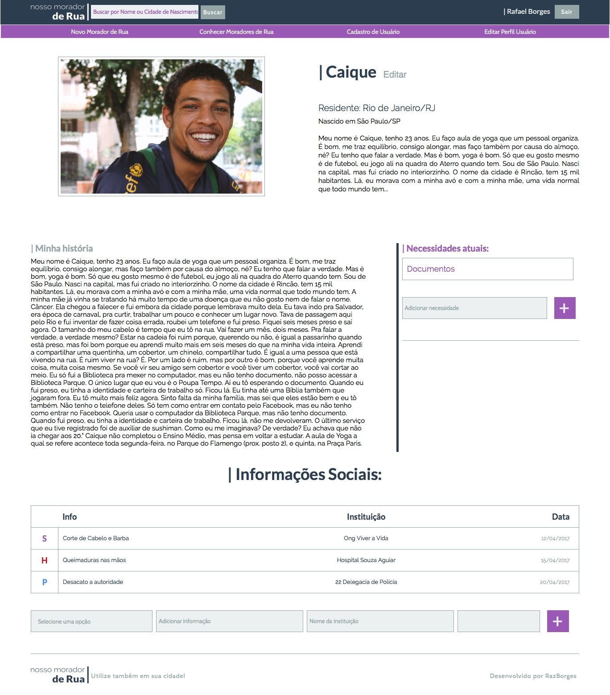

# Nosso Morador de Rua

Sistema para cadastro e acompanhamento de moradores de rua por Ong`s ou equipes de Serviço Social.

Permite o cadastro do morador de rua com as seguintes características:

- Nome
- Cidade/UF de Moradia
- Cidade de Origem
- Foto
- Histórico

Após o cadastro realizado o usuário poderá editar para cada morador de rua:

- Suas Necessidades atuais;
- Acompanhamento de informações de emergência, policial ou de serviços sociais.

Todo o layout e o respectivo CSS foi criado por mim do zero utilizando a técnica ITCSS para auxiliar na organização do código, com excessão do Normalize.

## Tecnologias Utilizadas

Neste projeto estão sendo utilizadas as seguintes tecnologias:

- NodeJS
- Express
- MongoDB (puro sem uso de ORM`s)
- EJS
- JavaScript
- HTML5
- SASS
- Gulp
- Outras dependências

## Considerações Finais

Este projeto já está funcional, mas ainda não está finalizado e também não possui o seu escopo completamente fechado.

#### Lista de tarefas do projeto

- [x] CRUD Morador de Rua
- [x] CRUD Usuário
- [x] Design
- [x] HTML e SASS
- [x] Integração view principal com backend
- [x] Integração formulários com backend
- [x] Páginas de erro 404 e 500
- [x] Implementação de Sessão
- [x] Criptografia de senha Usuário
- [x] Autorização de Sessão com os respectivos bloqueios
- [x] Formatação de data na view do Morador de Rua
- [x] Adição de classes conforme o tipo de informação na view de Morador de Rua
- [x] Validação de formulários
- [x] Upload/Visualização de imagens dos Moradores de Rua
- [x] Redefinir a senha do Usuário (sistema simples)
- [x] Busca por nome ou por cidade de origem do Morador de Rua
- [ ] Refatoração da view de edição de Morador de Rua
- [ ] Layout mobile